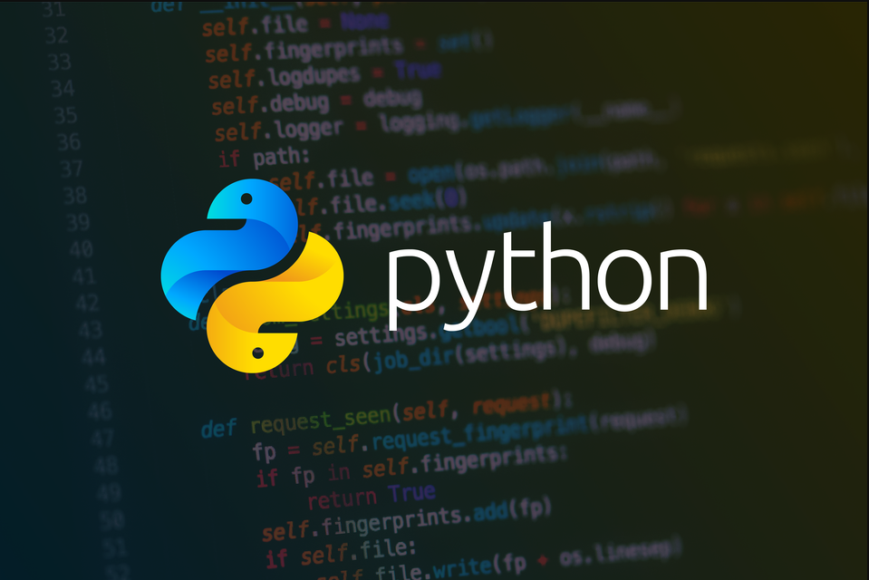
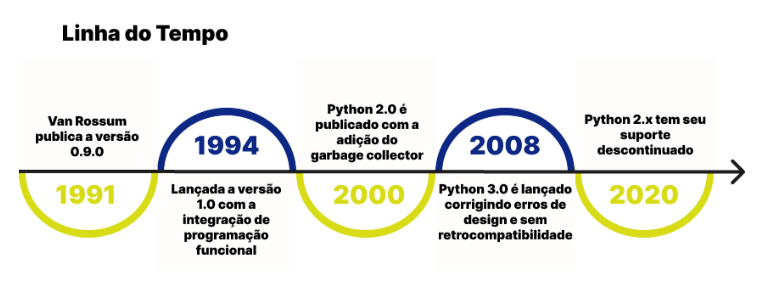
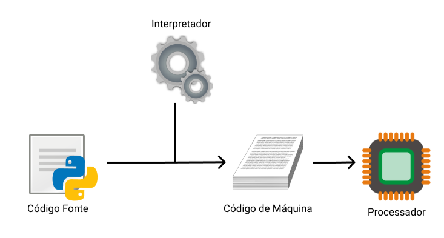

# 📚 Introdução 

 Python é uma linguagem Open-Source de propósito geral usado bastante em data science, machine learning, desenvolvimento de web, desenvolvimento de aplicativos, automação de scripts, fintechs e mais.

- Fácil de ler, escrever e manter;
- Eficiente para fazer protótipos, tornando validações mais práticas;
- Altamente escalável e poderoso, grandes empresas como Google e Netflix usam; 
- Moldável: você consegue facilmente acessar, adicionar bibliotecas para funções específicas;

 

# 📰 Breve Histórico

    
    

 

# 🧰 Linguagem interpretada

    

  

#### Fontes: 
📌 [Python](https://pt.wikipedia.org/wiki/Python)  
📌 [Introdução Python](https://www.alura.com.br/artigos/python-uma-introducao-a-linguagem)